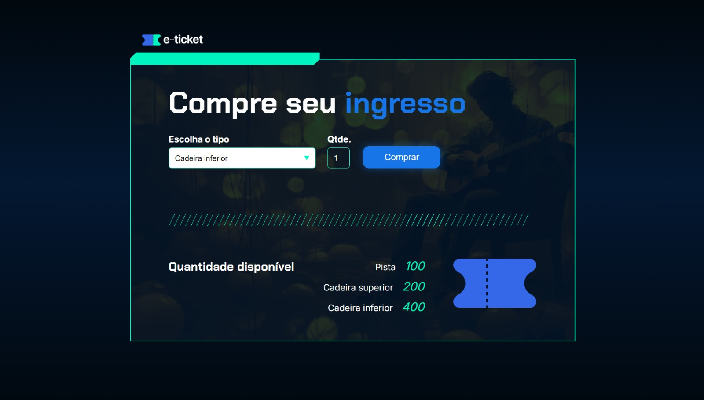

# E-Ticket

        

### 📌 Tópicos 

📃 [Descrição do projeto](#-descrição-do-projeto)  
📊 [Linguagens e tecnologias utilizadas](#-linguagens-e-tecnologias-utilizadas)  
❓ [Como utilizar](#-como-utilizar)  
🫱🏻‍🫲🏻 [Autores](#-autores)

## 📃 Descrição do projeto 

O E-Ticket é um projeto com o objetivo de criar um site para os usuários comprarem ingressos para um show escolhendo o tipo de ingresso e a quantidadde que será comprada. O projeto em questão foi desenvolvido em uma das aulas de lógica de programação da Alura.

## 📊 Linguagens e tecnologias utilizadas

- `HTML`
- `CSS`
- `JavaScript`

## ❓ Como utilizar

Para utilizar basta baixar o projeto e abrir o arquivo `index.html` no seu navegador, também é possível ver uma [prévia do site](https://e-ticket-nine.vercel.app/) sem precisar baixar.

## 🫱🏻‍🫲🏻 Autores

| [ Davi Gazola](https://github.com/davigzola) |  [ Jacqueline Oliveira](https://github.com/jacqueline-oliveira) |  [ Rodrigo Ferreira](https://github.com/rcaneppele) |
| :---: | :---: | :---: |
